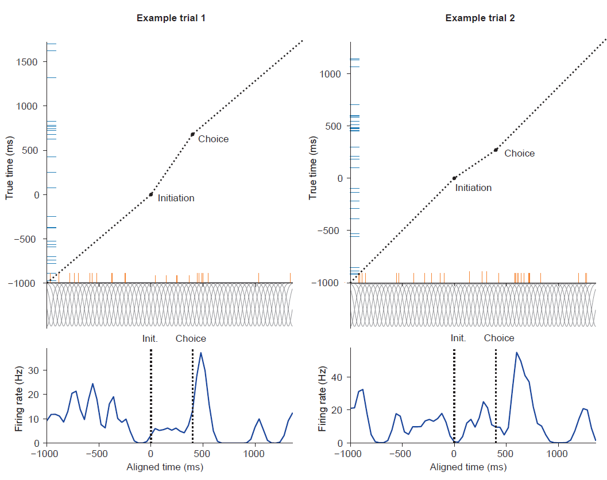
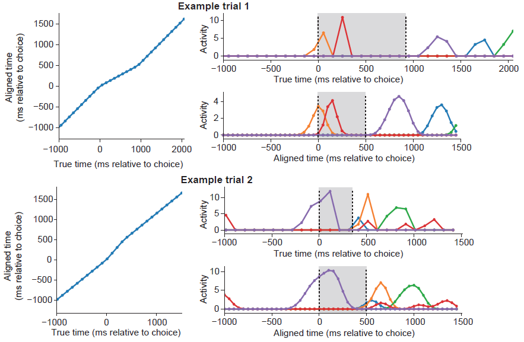

# Time-warping for trial alignment of neural activity.

This repository contains Python code for time-warping neurophysiological data to align activity across trials of a behavioural task.  It contains two functions *align_spikes* and *align_signals* for warping discrete spike data and continuous data respectively.  Both functions work by linearly warping activity between a set of reference points of interest, e.g. the times of trial initiation and choice, to align activity on each trial onto a single set of reference time points, usually the median timings across trials.  See the docstrings in the code for details of how to use each function. 

##  Align spikes

The *align_spikes* function is used to align spike activity in the form of spike times and corresponding neuron IDs.   It is described [Samborska et al. Nature Neuroscience 2022](https://www.nature.com/articles/s41593-022-01149-8) and illustrated in figure S4 of that manuscript, reproduced below.  

**Figure legend:** Diagram illustrating alignment of spike activity across trials. Trials were aligned using the times of initiation and choice port entry, by warping the interval between these two events to match the median interval. Top panels show spike times in the true (blue ticks) and aligned (orange ticks) time reference frames. Spike times were transformed by linear interpolation between the reference points. The output firing rate (bottom panels) was calculated at points spaced every 40ms in the aligned reference frame using Gaussian smoothing (40ms standard deviation) of the spike train. To compensate for the change in spike density due to the time warping, spikes were weighed by the stretch factor between the true and aligned reference frames (weighting is indicated by height of the orange ticks) prior to Gaussian smoothing. 

## Align signals

The *align_signals* function is used to align continuous data, which could be photometry or imaging signals, or the output of motion tracking software such as DeepLabCut.  It is described in [Akam et al. Neuron 2021](https://www.cell.com/neuron/fulltext/S0896-6273(20)30809-6) and illustrated in figure S4 of that manuscript, reproduced below.

**Top panels:** Alignment of imaging data on a trial where the interval between choice and second-step port entry was longer than the median interval. Left panel shows the true and aligned times of microscope frames plotted against each other. Right top panel shows the activity of 5 neurons before alignment. Vertical dashed lines show the times of choice and second-step port entry. Right bottom panel shows the activity of the same 5 neurons after alignment, up-sampling and smoothing. Grey shaded regions indicate the interval between choice and second-step port entry that is time-warped **Bottom panels:** As above but for a trial where the interval between choice and second-step port entry was shorter than the median interval. 
